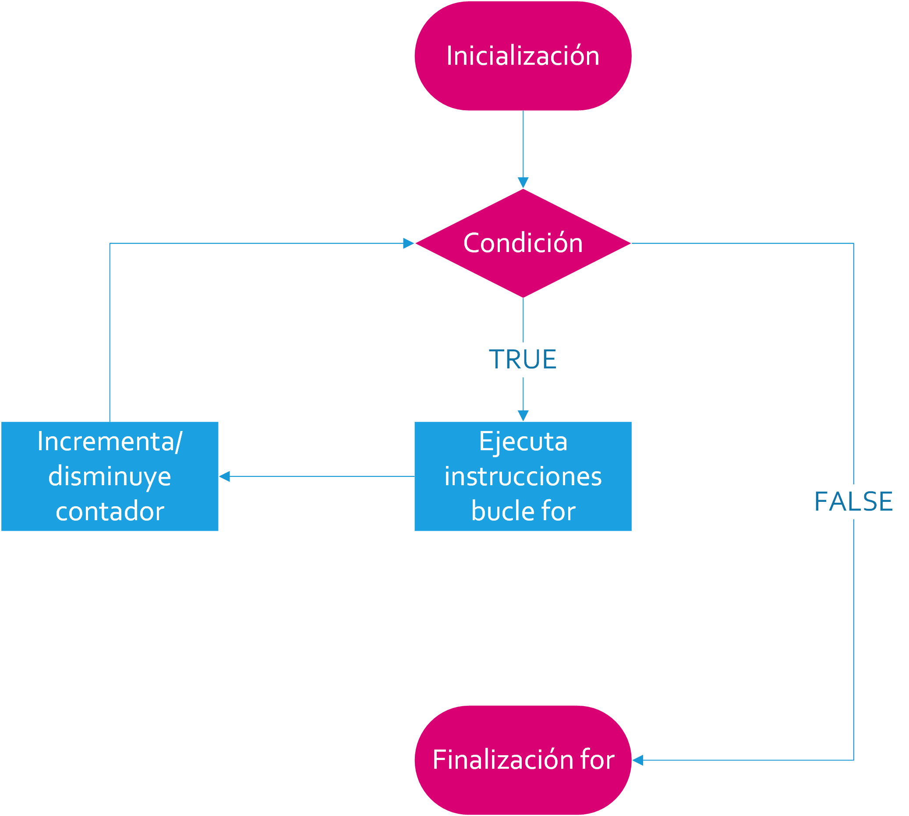
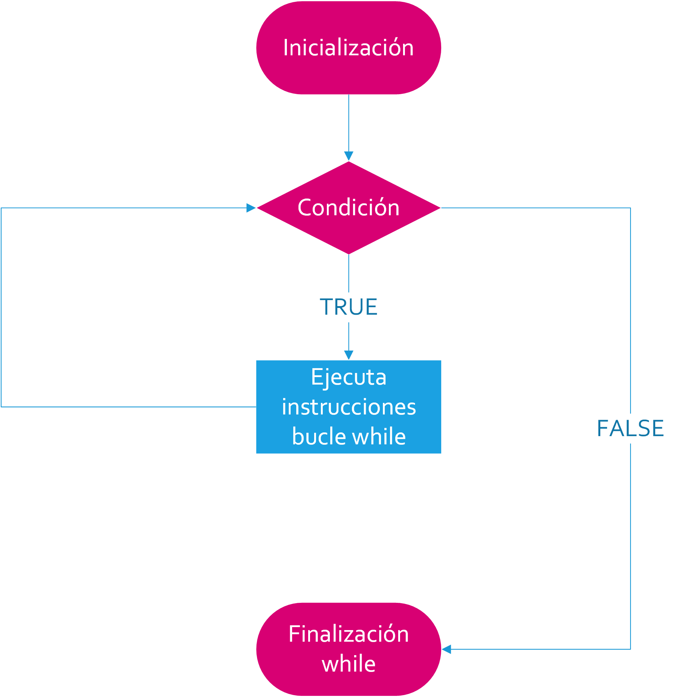
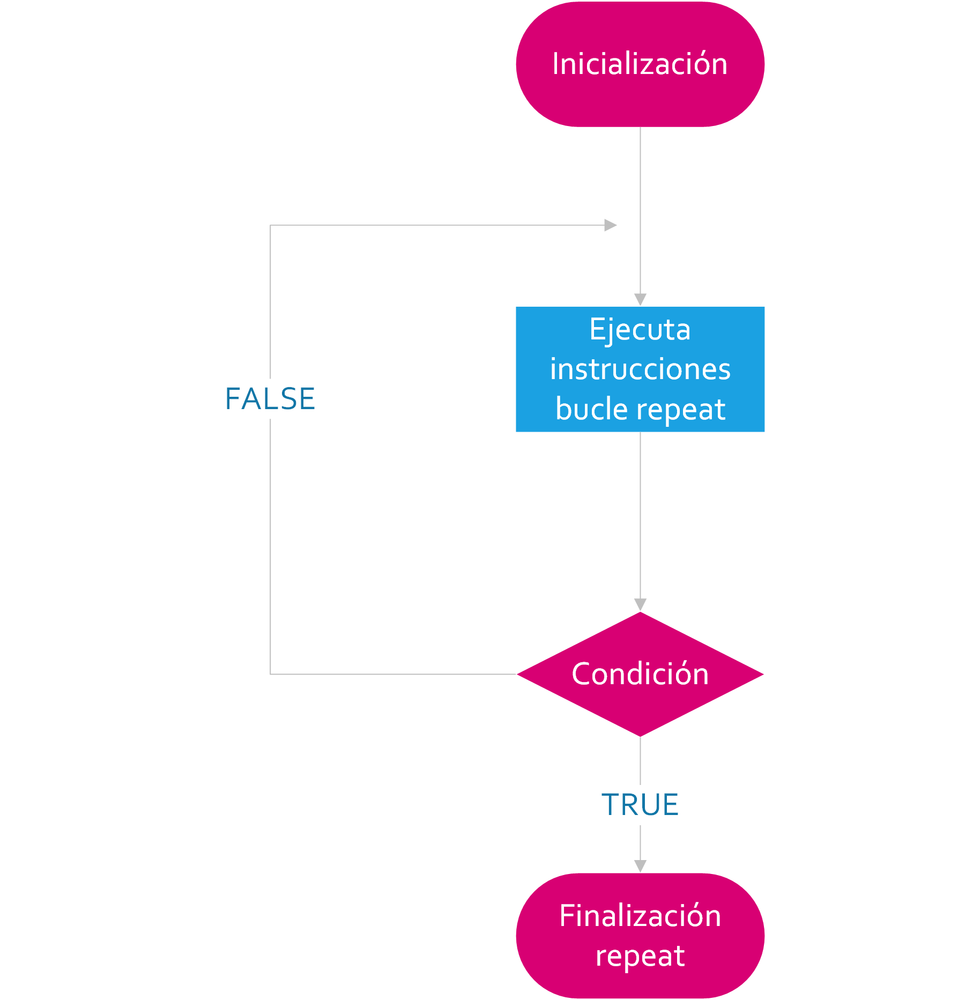
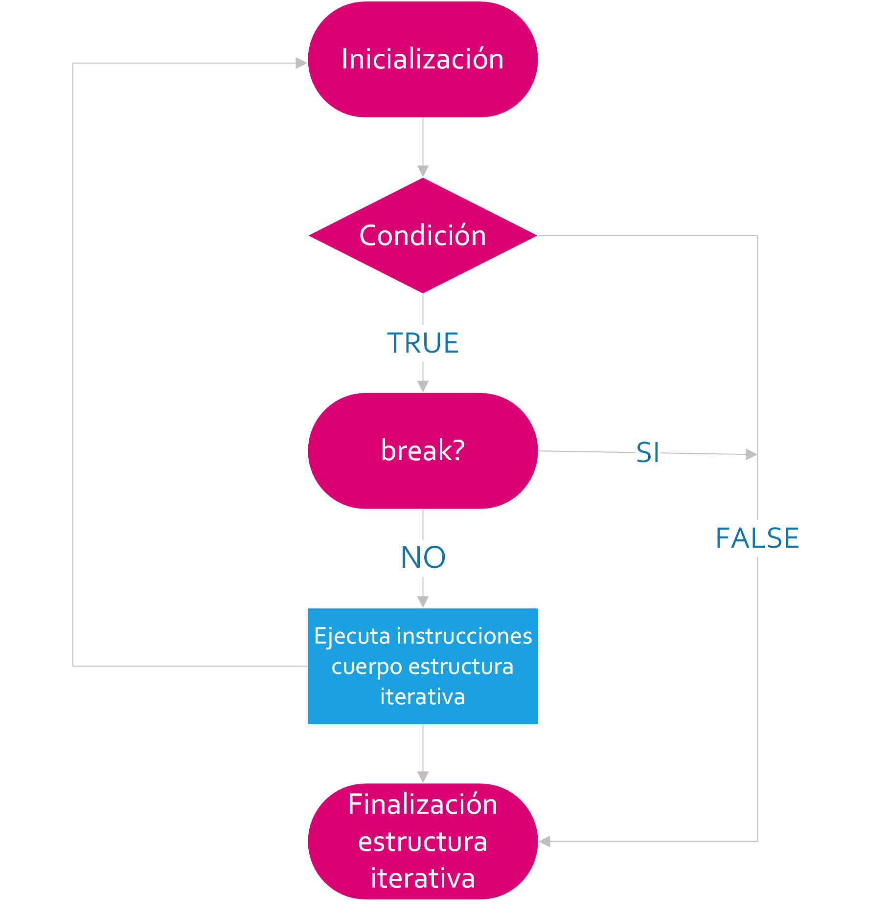
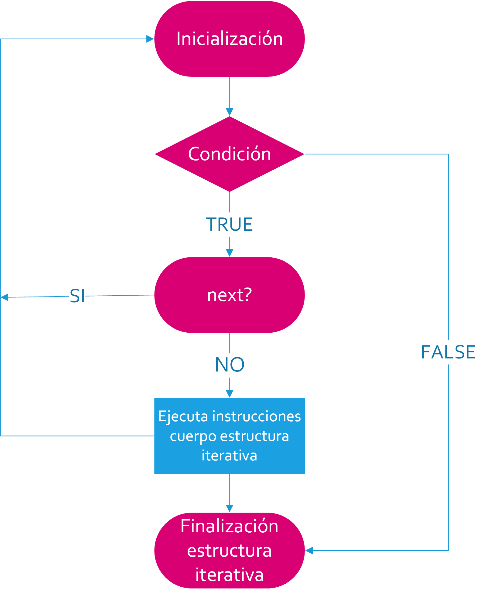

```{r knitsetup, echo=FALSE, results='hide', warning=FALSE, message=FALSE, cache=FALSE}
opts_knit$set(base.dir='./', fig.path='', out.format='md')
opts_chunk$set(prompt=FALSE, comment='', results='markup', collapse=TRUE,echo=TRUE, eval=TRUE)

library(purrr)
```


<!-- ```{r, include=FALSE} -->
<!-- tutorial::go_interactive() -->
<!-- ``` -->


# Estructuras Iterativas

Las instrucciones de repetición, de iteración o bucles, facilitan la repetición de un bloque de instrucciones, un número determinado de veces o mientras se cumpla una condición.

Por lo general, existen dos tipos de estructuras iterativas o bucles en los lenguajes de programación. Encontraremos un tipo de bucle que se ejecuta un número preestablecido de veces, que es controlado por un contador o índice, incrementado en cada iteración. Este tipo de bucle forma parte de la familia  `for`.

Por otro lado, encontraremos un tipo de bucle que se ejecuta mientras se cumple una condición. Esta condición se comprueba al principio o el final de la construcción. Esta variante pertenece a la familia `while` or `repeat`, respectivamente.

Por último, siempre podemos consultar los comandos de control del flujo mediante `?Control` en la consola de RStudio.


## Bucle __`for`__

El bucle `for` es una estructura iterativa que se ejecuta un número preestablecido de veces, que es controlado por un contador o índice, incrementado en cada iteración.

A continuación, mostramos el diagrama de flujo del bucle `for`. En términos de diagramas de flujo, los rectángulos significan la realización de un proceso, en otras palabras la ejecución de un bloque de instrucciones. Por otro lado, los rombos con conocidos como símbolos de decisión, es decir se corresponden a preguntas cuyas respuestas únicamente tienen dos posibles respuestas, concretamente, TRUE (T) o FALSE (F).




Una o mas instrucciones dentro del rectángulo de inicialización son seguidas por la evaluación de la condición en una variable la cual puede asumir valores dentro de una secuencia. En la [figura](https://i.imgur.com/i5vInG7.png), esto es representado por el símbolo del rombo.

En otras palabras, estamos comprobando si el valor actual de la variable está dentro de un rango específico. Por lo general, especificaremos el rango en la inicialización.

Si la condición no se cumple, es decir el resultado es `False`, el bucle nunca se ejecutará. Esto es indicado por la flecha de la derecha de la estructura `for`. El programa entonces ejecutará la primera instrucción que se encuentre después del bucle.

Si la condición se verifica, una instrucción o bloque de instrucciones es ejecutado. Una vez la ejecución de estas instrucciones ha finalizado, la condición es evaluada de nuevo. En la [figura](https://i.imgur.com/i5vInG7.png) esto es indicado por las líneas que van desde el rectángulo que incrementa o disminuye el contador hasta el símbolo del rombo que evalúa la condición.

Por ejemplo, en el siguiente fragmento de código calculamos la media de un conjunto de observaciones, que se obtiene dividiendo la suma de todas las observaciones por el número de individuos:

```{r}
# Creamos un vector aleaotorio de 10 observaciones
observaciones <- sample(1:50, 100, replace = TRUE)

# Inicializamos `suma` de todas las observaciones
suma <- 0

# Creamos un bucle for que calcula la media
for(i in seq_along(observaciones)) {
  suma <-  observaciones[i] + suma
  media <- suma / length(observaciones)
}

# Mostramos por pantalla la media
media
```

### Bucles __`for`__ Anidados

Los bucles `for` pueden ser anidados. En el siguiente fragmento de código creamos un algoritmo que calcula la suma de dos matrices cuadradas:

```{r}
# Creamos dos matrices cuadradas
m1 <- matrix(sample(1:100, 9, replace = TRUE), nrow = 3)
m2 <- matrix(sample(1:100, 9, replace = TRUE), nrow = 3)

# Inicializamos la matriz que contendra m1+m2
suma <- matrix(nrow = 3, ncol = 3)

# Para cada fila y cada columna, realizamos la suma elemento a elemento 
for(i in 1:nrow(m1)) {
  for(j in 1:ncol(m1)) {
    suma[i, j] <- m1[i, j] + m2[i, j]
  }
}

# Mostramos por pantalla la suma de m1+m2
suma
```

El siguiente ejemplo sirve para ejemplificar el anidamiento de bucles `for`. Cada uno con su propio bloque de instrucciones y manejado con su propio índice. Es decir, `i` controla las filas de las matrices y `j` las columnas.


## Bucle __`while`__

Cuando nos encontramos en la situación en la que no conocemos el número de iteraciones de antemano, podemos hacer uso del bucle `while`. Este bucle se ejecuta mientras se cumple una condición que se comprueba al principio de la construcción.

A continuación se muestra el diagrama de flujo de `while`:



La estructura de una construcción `while` está compuesta de un bloque de inicialización, seguido por una condición lógica. Esta condición es normalmente una expresión de comparación entre una variable de control y un valor, en la que usaremos los operadores de comparación, pero cabe señalar que cualquier expresión que evalúa a un valor lógico, `TRUE` o `FALSE`, es válida.

Si el resultado es `FALSE` (F), el bucle nunca será ejecutado. Esto es indicado por la flecha de la derecha en la [figura](https://i.imgur.com/i5vInG7.png). En esta situación el programa ejecutará la primera instrucción que encuentre después del bloque iterativo.

Por otro lado, si el resultado es `TRUE` (T), la instrucción o bloque de instrucciones del cuerpo de `while` son ejecutadas. Esto sucederá hasta que la condición lógica sea `FALSE`.

El siguiente ejemplo es un ejemplo de utilización de la estructura `while`:

```{r}
# Algoritmo que muestra por pantalla los 10 primeros números naturales
n = 1
while(n <= 5) {
  print(n)
  n = n + 1
}


```

## Bucle __`repeat`__

El bucle `repeat` es similar a `while`, excepto que la instrucción o bloque de instrucciones de `repeat` es ejecutado al menos una vez, sin importar cual es el resultado de la condición.

A continuación, como en los apartados anteriores mostramos el [diagrama de flujo](https://i.imgur.com/i5vInG7.png) de la estructura `repeat`:



Como alternativa al ejemplo anterior, podríamos codificar el algoritmo como:

```{r}
# Algoritmo que muestra por pantalla los 10 primeros números naturales
n = 1
repeat {
  if(n <= 10) {
    print(n)
    n = n +1
  } else {
    break
  }
}
```

En el ejemplo de la estructura `repeat` podemos observar que el bloque de código es ejecutado al menos una vez y que finaliza cuando la función `if` es verificada.

Observemos que hemos tenido que establecer una condición dentro del bucle la cual establece la salida con la cláusula [`break`](#break). Esta cláusula nos introduce en el concepto de __salida de las iteraciones__ en los bucles y que pasamos a analizar en el apartado siguiente.

## Cláusula __`break`__ {#break}


La instrucción `break` se utiliza con las intrucciones de bucle `for`, `while` y `repeat`.

La cláusula `break` finaliza la ejecución del bucle  más próximo en el que aparece. El control pasa a la instrucción que hay a continuación del final de la instrucción, si hay alguna.

A continuación se muestra el [diagrama de flujo](https://i.imgur.com/PkhhUjz.png) de `break`:



Como podemos ver en el diagrama de flujo, la instrucción `break` finaliza la ejecución de la instrucción envolvente `for`, `while` o `repeat` mas próxima. El control pasa a la instrucción que hay a continuación de la instrucción finalizada, si hay alguna.

Para ilustrar mejor el uso de `break` crearemos un algoritmo que define una [matriz cuadrada](https://es.wikipedia.org/wiki/Matriz_cuadrada)  y que utiliza dos bucles `for` anidados para calcular la [diagonal principal](https://es.wikipedia.org/wiki/Diagonal_principal) y su [matriz triangular superior](https://es.wikipedia.org/wiki/Matriz_triangular):


```{r}


# Creamos una matriz cuadrada de 6 x 6
m <-
  matrix(
    data = sample(x = 10, size = 36, replace = TRUE),
                  nrow = 6,
                  ncol = 6
  )
# Mostramos por pantalla `m`
m

# Creamos un vector para la diagonal principal
diagonal_principal <- vector(mode = "integer", length = nrow(m))
diagonal_principal

# Algoritmo que calcula la matriz triangular inferior y su diagonal principal
for (i in 1:nrow(m)) {
  for (j in 1:ncol(m)) {
    if (i == j) {
      break
    } else {
      m [i, j] <- 0
    }
    
  }
  diagonal_principal[j] <- m[i, j]
}

# Mostramos por pantalla diagonal principal
diagonal_principal
# Mostraamos por pantalla matriz inferior de m
m
```

Examinaremos brevemente ahora el código anterior, como se puede observar en primer lugar se define una matriz cuadrada de 6 x 6 y creamos un vector de tipo entero con una longitud de 6 que en el momento de su inicialización contiene todos sus valores igual a cero.

Cuando los indices son iguales cumpliéndose la condición del bucle `for` mas interno, y que itera mediante `j` por las columnas de la matriz, se ejecuta un `break` y el loop mas interno es interrumpido para saltar directamente a la instrucción del bucle mas externo. Esta instrucción calcula la diagonal principal de la matriz. Seguidamente, el control pasa la condición lógica del bucle más externo que itera por las filas de `m` mediante el índice `i`.

En el caso de que los indices sean diferentes, a la posición del elemento `[i, j]` se le asigna el valor de cero con el propósito de calcular la matriz triangula superior.

Por otro lado, dentro de instrucciones anidadas, la instrucción `break` finaliza solo la instrucción `for`, `while` o `repeat` que la envuelve inmediatamente. Podemos utilizar la instrucción `next` para transferir el control desde estructuras más anidadas. Esta cláusula nos introduce en el concepto de  __interrupción de las iteraciones__ en una estructura iterativa y que pasamos a analizar en el apartado siguiente.


## Cláusula __`next`__

La cláusula `next` interrumpe una iteración y salta al siguiente ciclo. De hecho, salta a la evaluación de la condición del bucle en el que se encuentra.

En otros lenguajes de programación el equivalente a `next` es conocido como __continue__, cuyo significado es el mismo: en la línea de código que te encuentres, bajo la verificación de la condición, salta a la evaluación del bucle.

El diagrama de flujo de `break` se muestra en la [figura](https://i.imgur.com/d9bD6H6.png) siguiente:



Examinemos a continuación el diagrama de flujo de la instrucción `break`.
Como hemos comentado con anterioridad `break` fuerza la transferencia del control a la expresión de control del bucle contenedor `for`, `while` o `repeat` más pequeño. Es decir, no se ejecuta ninguna de las instrucciones restantes de la iteración actual. La siguiente iteración del bucle se determina del modo siguiente:

* En un bucle `while` o `repeat`, la siguiente iteración se inicia reevaluando la expresión de control de la instrucción `while` o `repeat`.

* En un bucle `for`, en primer lugar se incrementa el índice del bucle. A continuación, se evalúa de nuevo la expresión de control de la instrucción `for` y, en función del resultado, el bucle finaliza o se produce otra iteración.

Pongamos por caso que queremos mostrar por pantalla los números pares de una secuencia de enteros:

```{r}
for (i in 1:10) {
  if(i %% 2)
    next
    print(i)
}
```

Este algoritmo utiliza el [teorema del resto](https://es.wikipedia.org/wiki/Teorema_del_resto) para calcular si un número es par o impar. Si el resto de dividir el número entre dos es igual a cero entonces se trata de un número par y es mostrado por pantalla.

Por otro lado, si el resto es diferente a cero será impar y saltará a la evaluación de la condición del bucle `for` ignorando cualquier instrucción que se encuentre a continuación. 

Hay que mencionar, además el uso del operador `%%` para calcular el resto de la división especificado en la condición lógica de la instrucción `if`.

## Alternativas al Uso de Bucles en R

### Vectorización

Como ya hemos visto con anterioridad, la vectorización nos permite realizar operaciones elemento a elemento en vectores y matrices.

Además, deberíamos saber a estas alturas que la estructura de datos elemental en R es el vector. Así pues, una colección de números es un vector numérico.

Si combinamos dos vectores de la misma longitud, obtenemos una matriz. Que como ya hemos visto podemos hacerlo vertical u horizontalmente, mediante el uso de diferentes instrucciones R. Es por eso, que en R una matriz es considerada como una colección de vectores verticales o horizontales. Lo dicho hasta aquí supone que, podemos vectorizar operaciones repetitivas en vectores.

De ahí que, la mayoría de las construcciones iterativas que hemos visto en los ejemplos de esta sección pueden realizarse en R por medio de la vectorización.

Sirva de ejemplo la suma de dos vectores `v1` y `v1` en un vector `v3`, la cual puede realizarse elemento a elemento mediante un bucle `for` como:


```{r}

n <- 4
v1 <- c(1, 2, 3, 4)
v2 <- c(5, 6, 7, 8)
v3 <- vector(mode = "integer", length = length(n))

for (i in 1:n) { 
	v3[i] <- v1[i] + v2[i] 
}
v3
```

Si bien, podemos usar como alternativa la vectorización nativa de R:

```{r}
v3 = v1 + v2
v3
```

### El Conjunto de Funciones __`apply`__

La familia `apply` pertenece al paquete base R y esta formado por un conjunto de funciones que nos permiten manipular una selección de elementos en matrices, arrays, listas y dataframes de forma repetitiva.

Es decir, estas funciones nos permiten iterar por los elementos sin tener la necesidad de utilizar explícitamente una construcción iterativa. Estas funciones toman como entrada una lista, matriz o array y aplican esta función a cada elemento. Esta función podría ser una función de agregación, como por ejemplo la media, u otra función de transformación o selección.

La familia `apply` esta compuesta de las funciones:

* [apply](https://www.rdocumentation.org/packages/base/versions/3.3.1/topics/apply)
* [lapply](https://www.rdocumentation.org/packages/base/versions/3.3.1/topics/lapply?)
* [sapply](https://www.rdocumentation.org/packages/base/versions/3.3.1/topics/lapply?)
* [vapply](https://www.rdocumentation.org/packages/base/versions/3.3.1/topics/lapply?)
* [mapply](https://www.rdocumentation.org/packages/base/versions/3.3.1/topics/mapply)
* [rapply](https://www.rdocumentation.org/packages/base/versions/3.3.1/topics/tapply)
* [tapply](https://www.rdocumentation.org/packages/base/versions/3.3.1/topics/tapply)


### El paquete __`purrr`__

El paquete [purr](http://purrr.tidyverse.org/) forma parte del ecosistema [tidyverse](https://www.tidyverse.org/) y esta compuesto de un conjunto de funciones que aprovechan el paradigma de [programación funcional](https://es.wikipedia.org/wiki/Programaci%C3%B3n_funcional) de R, proporcionando un conjunto completo y consistente de herramientas para trabajar con funciones y vectores.

#### Instalación

```{r eval=FALSE}
# La manera mas facil de conseguir `purrr` es instalar el ecosistema tidyverse
install.packages("tidyverse")

# Alternativamente, podemos instalar solo purrr:
install.packages("purrr")
```


#### Uso

El siguiente ejemplo sirve para demostrar las diferentes alternativas que disponemos para realizar un [algoritmo iterativo](https://es.wikipedia.org/wiki/Algoritmo_iterativo)  mediante las herramientas que hemos visto en este capítulo.

Consideremos que queremos calcular el cuadrado de cada elemento en una secuencia de enteros del 1 a `n`. La primera solución pasa por utilizar una construcción iterativa:

```{r}
n <- 5
res <- rep(NA_integer_, n) 
for (i in seq_len(n)) {
  res[i] <- i ^ 2
}
res
```

La segunda opción es por medio de la vectorización:

```{r}
n <- 5
seq_len(n) ^ 2
```

En tercer lugar, mediante `sapply`:

```{r}
n <- 5
sapply(1:n, function(x) x^2)
```


Por último, mediante `purrr::map()`:

```{r}
n <- 5
map_dbl(1:n,  function(x) x ^ 2)
```

En este ejemplo por la sencillez del caso las dos últimas alternativas no son necesarias y la correcta sería hacerlo mediante vectorización. Pero en estructuras de datos y funciones mas complejas optaríamos por cualquiera de las dos últimas opciones.

En este curso y en un [módulo posterior](), trataremos en profundidad el uso del paquete `purrr` que hace uso de la programación funcional en las iteraciones en oposición al paradigma de la iteración imperativa y que hemos tratado en este capítulo. Una vez dominemos las funciones en el paquete `purrr`, seremos capaces de resolver la gran mayoría de algoritmos que impliquen la iteración con menos código, mas legible y con menos errores.


## Consejos para el uso de Bucles en R

* Siempre que sea posible hemos de poner la menor cantidad de instrucciones dentro de una estructura iterativa. Puesto que, todas las instrucciones dentro de un bucle se repiten varios ciclos y quizás no sea necesario.

* Hemos de tener cuidado con el uso de `repeat`, asegurándonos que definimos de forma explícita una condición para finalizar la estructura, de lo contrario nos encontraremos ante una iteración infinita.

* Tratar de usar como alternativa a los bucles anidados la [recursividad en funciones](https://es.wikipedia.org/wiki/Algoritmo_iterativo). Es decir, es mejor el uso de una o mas llamadas a funciones dentro del bucle a que este sea demasiado grande.

* La peculiar naturaleza de R nos sugiere no usar las construcciones iterativas para todo, cuando disponemos de otras alternativas como la vectorización, la familia `apply` y el paquete `purrr`. 


[for]:https://i.imgur.com/ggkzeJR.png
[while]:https://i.imgur.com/JdLHPIL.png
[repeat]:https://i.imgur.com/OXnEscG.png
[break]:https://i.imgur.com/AGH5wIx.png
[next]:https://i.imgur.com/vZknTyQ.png


