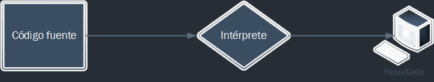
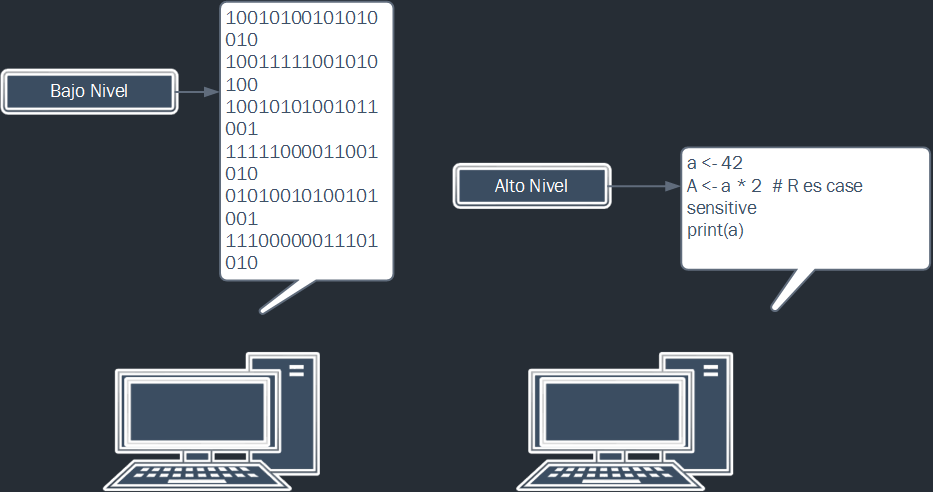

## Objetivos

Felicitaciones¡¡ Acabas de empezar tu aventura para llegar a ser un programador en R. Para ir calentando tus músculos mentales, este video empieza con un suave calentamiento. Antes de empezar a escribir programas, hablaremos sobre lo que es R.
Despues de ver este video, deberías:

> - Saber para que puedes usar R
> - Conocer un poco de historia de R
> - Saber las características del lenguaje

## ¿Qué és R? 

Sólo para confundirte, R se refiere a dos cosas.
Afortunadamente, la mayoría de las veces quedará claro a que R nos estamos refiriendo según el contexto.

> - R es un lenguaje de programación
> - R es el software que usaremos para ejecutar programas en R

## El entorno R 

R proporciona un amplio abánico de herramientas para la manipulación, cálculo y visualización de datos. Esto incluye:

> - Facilidades para el manejo y almacenamiento de datos
> - Un conjunto de operadores para el cálculo en arreglos (arrays) y en particular para matrices
> - Un conjunto de herramientas para el análisis de datos
> - Herramientas para realizar visualizaciónes de gráficos
> - Un lenguaje de programación que incluye estructuras condicionales, iterativas, funciones y medios para importar/exportar datos.

## Un poco de historia {.build}

R (el lenguaje) fue creado a principios de los '90 por Ross Ihaka y Robert Gentleman, profesores de la Universidad de Auckland. Esta basado en el lenguaje S que fue desarrollado en los Laboratorios Bell en la década de los '70 por John Chambers.
R(el softwate) es un proyecto GNU, lo que refleja su estatus como un software libre y de código fuente abierto.Ambos el lenguaje y el sofware, actualmente estan desarrollados por un grupo de 20 personas conocido como el R Core Team.

#### - El lenguaje

> - Creado a principios de los '90 
> - Basado en el lenguaje S
> - Actualmente desarrollado por el R Core Team

#### - El software

> - Proyecto GNU
> - Actualmente desarrollado por el R Core Team

## Características del lenguaje {.build}

R es un lenguaje interpretado (conocido también como lenguaje de scripts), lo que significa que nuestro código no necesita ser compilado para poder ejecutarlo. También és un lenguaje de alto nivel de modo que no necesitamos conocer la arquitectura de nuestro ordenador en el que estamos ejecutando nuestro código

> - Es un lenguaje interpretado

 
 

--- 

 También és un lenguaje de alto nivel de modo que no necesitamos conocer la arquitectura de nuestro ordenador en el que estamos ejecutando nuestro código

- Es un lenguaje de alto nivel

--- 

R soporta un mezcla de paradigmas en programación. En su núcleo, es un lenguaje imperativo (es decir, nosotros escribiremos un script que hace un cálculo tras otro), pero tambíen soporta programación orientada a objetos (esto es, los datos y las funciones estarán combinados dentro de las clases) y programación funcional donde las funciones serán objetos de primera clase, dónde se tratarán como si fueran cualquier otra variable y que además pueden podrán ser llamadas recursivamente.)

R soporta un mezcla de paradigmas en programación:

> - Lenguaje imperativo 
> - Lenguaje orientado a objetos
> - Programación funcional

## Resumen

En esta sección hemos visto:
Por último, quisiera comentar a aquellos que no provengan de disciplinas relacionadas con las ciencias de computación no tienen que sentirse abrumados por los terminos vistos en las características del lenguaje, puesto que no es necesario saber que son para llegar a ser eficiento en el uso del lenguaje R.
En el siguiente video veremos dónde conseguir R y como instalarlo en nuestro computador.

> - R es un lenguaje libre y de código abierto
> - También es un software para ejecutar programas escritos con R
> - Características del lenguaje

