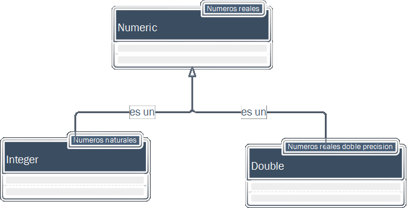

<style>
h2 { 
   font-size: 36px; 
   line-height: 65px; 
   letter-spacing: -2px; 
   color: #FFFFFF;} 
</style>

<style>
.title-slide {
  background-color: #8BBB27;
}
</style>

<style>
slides > slide.backdrop {
  background:#262D35;
}
</style>

<style>
pre {
  width : 70%;
  padding: 10px 15px 10px 15px;
  left: 0px;
  background-color: #2A3137;
}
</style>

<style>
.prettyprint {
  background-color: #c4c6c6;
}
</style>

<style> 
slides > slide:not(.nobackground):before {
  margin: 40px 5px;
}
</style>

<style>
table.rmdtable th { 
   color: #515151; 
   background: -webkit-gradient(linear, 50% 0%, 50% 100%, color-stop(40%, #CED815), color-stop(80%, #989e1d)) no-repeat; 
   background: -webkit-linear-gradient(top, #CED815 40%, #989e1d 80%) no-repeat; 
   background: -moz-linear-gradient(top, #CED815 40%, #989e1d 80%) no-repeat; 
   background: -o-linear-gradient(top, #CED815 40%, #989e1d 80%) no-repeat; 
   background: linear-gradient(top, #CED815 40%, #989e1d 80%) no-repeat; 
 } 
</style>

## Expresiones 

<div class = "note">
El código R está compuesto por una serie de _expresiones_. Ejemplo de expresiones en R incluyen, expresiones aritméticas,, instrucciones de control (condicionales e iterativas) e instrucciones de asignación.
</div>

El código R está compuesto por una serie de _expresiones_.

Ejemplos:


```r
#  Expresión aritmética
127 %% 10
```


## Expresiones

El código R está compuesto por una serie de _expresiones_.

Ejemplos:


```r
# Instrucción condicional
if (1 > 2) "mayor" else "menor"
```

## Expresiones

El código R está compuesto por una serie de _expresiones_.

Ejemplos:


```r
# Instrucción asignación
x <- 1
```


## Instrucciones de asignación {.build}


<div class="note">
Podemos crear nuevos objetos con el operador de asignación <-. El operador de asignación es la combinación de las teclas < (menor que) y - (menos)
Todas las instrucciónes de asignación dónde creamos objetos, tienen la misma forma: nombre del objeto, operador de asignación y valor. En lenguaje natural podemos traducirlo como a "este objeto asignale el siguiente valor"."
</div>

>- Creamos objetos con el operador de asignación

>- Las instrucciones de asignación tienen la forma:

    - nombre_objeto <- valor
    
## Expresiones

> -R proporciona diferentes construcciones para agrupar expresiones:

    - punto y coma
    - paréntesis
    - llaves
  
## Separando expresiones con punto y coma

Podemos escribir una serie de expresiones en líneas separadas:


```r
x <- 1
y <- 2
z <- 3
```

Alternativamente, podemos colocarlas en la misma línia, separadas por punto y coma:


```r
x <- 1; y <- 2; z <- 3
```

## Paréntesis

La notación con paréntesis devuelve el resultado de evaluar la expresión dentro del paréntesis:


```r
(x <- 1)
```


```r
# es equivalente
x <- 1
x 
```
<div class="note">
La notación con paréntesis devuelve el resultado de evaluar la expresión dentro del paréntesis:
El siguiente ejemplo es un atajo cuando queremos crear un objeto y mostrar su valor al mismo tiempo.
</div>

##

Agrupar expresiones con paréntesis puede ser usado para modificar la prioridad  en los operadores:


```r
2 * 5 + 1
```


```r
2 * (5 + 1)
```

<div class="note">
Agrupar expresiones con paréntesis puede ser usado para modificar la prioridad  en los operadores:
Como sabemos de las matemáticas la multiplicación tiene prioridad sobre la suma como podemos ver en el siguiente ejemplo. Pero si lo hacemos de este modo hará que R calcule primero la suma de 5 + 1 y después haga la multiplicación.
</div>

## {.build}

R siempre evaluará del paréntesis mas interno al más externo (como una calculadora)


```r
factorial(round(2.0015) + 1)
```


```r
factorial(2 + 1)
```


```r
factorial(3)
```


```r
factorial(3)
```


## Llaves

Las llaves son usadas para evaluar una serie de expresiones (separadas por nuevas líneas o punto y comas) y, nos devolverán el resultado de la última expresión:


```r
{x <- 1; y <- 2; x + y}
```

Usado para agrupar un conjunto de expresiones en el cuerpo de una función:


```r
f <- function() {x <- 1; y <- 2; x + y}
f()
```

<div class="note">
Como podemos ver en el primer ejemplo, primero creamos dos variables mediante dos instrucciones de asignación para posteriormente realizar la suma de los valores de las variables mediante una expresión aritmética.
Este tipo de construcción es usado para agrupar un conjunto de expresiones en el cuerpo de una función y que veremos ampliamente el el modulo de funciones de este mismo curso.
</div>

## Objetos

<div class="note"> 
Todo el código R manipula objetos. El objeto, es el concepto principal sobre el cual se fundamenta la tecnología orientada a objetos. Un objeto puede ser visto como una entidad que posee atributos y efectúa acciones. Ejemplos de objetos en R incluyen las funciones, symbol (nombre objetos) e incluso las expresiones. A continuación se muestran algunos ejemplos de objetos:
</div>
 
Todo en R es un objeto

Ejemplos:


```r
# Una función es un objeto
function() {x <- 1; y <- 2; x + y}
```


## Objetos

Todo en R es un objeto

Ejemplos:


```r
#también su nombre (symbol)
f <- function(x, y){x + y}
f(1, 2)
```

## Objetos


Ejemplos:


```r
# incluso las expresiones 

{x <- 1; y <- 2; x + y}
```


## Cada objeto tiene un tipo

<div class="note">
Cada objeto en R tiene un tipo. El tipo de un objeto define como es almacenado el objeto en R.  Podemos conocer el tipo de objeto con la funcion __typeof__ .

</div>


- El _tipo_ define como es almacenado
- Podemos conocer el tipo de un objeto con __typeof(mi_objeto)__


Ejemplo:


```r
vector_numerico <- c(1, 2, 3, 4, 5)
typeof(vector_numerico)
```


## Cada objeto es miembro de una clase

<div class="note">
Además, cada objeto es miembro de una clase.  Las clases definen que información el objeto contiene y como pueden ser usados. Para determinar la clase de un objeto usaremos la funcion __class__ .
</div>

- La _clase_ define que información contiene y como usarlo
- Podemos conocer la clase de un objeto con __class(mi_objeto)__


```r
vector_numerico <- c(1, 2, 3, 4, 5)
class(vector_numerico)
```

## Comprobar la clase de un objeto en nuestros scripts
<div class="note">
El uso de la función _class_ es útil para examinar nuestros objetos en un trabajo interactivo con la consola de R, pero si necesitamos comprobar el tipo de un objeto en nuestros scripts, es mejor el uso de la funcion _is_. En una situación tipica, nuestro test se parecera al siguiente:
</div>

### Podemos utilizar la función genérica __is()__

Ejemplo:


```r
if(!is(x, "alguna_clase")) {
  
  # alguna acción correctiva
}
```

## Comprobar la clase de un objeto en nuestros scripts 
<div class="note">
La mayoria de las clases tienen su propia funcion __is.*__, utilizar esta función es mas efectivo que el uso de la función general __is__
</div>

### Alternativamente podemos utilizar la función is.*()

Ejemplo:


```r
is.character("Ciencia de Datos con R")
```


## Nombres de los objetos {.build}

<div class="note">
Los nombres de los objetos (conocidos formalmente por symbol) pueden contener letras, numeros, puntos y guiónes bajos, pero no pueden empezar con un número o un punto seguido de un número. Por último, no podemos hacer uso de las palabras reservadas del lenguaje como "if" y "for". 
</div>

 > - Conocidos formalmente por _symbols_
 > - Pueden contener: 
 
      - letras
      - números
      - guión bajo (-)
      - punto (.)
      
> - Deben empezar con una letra
> - No podemos utilizar las palabras reservadas del lenguaje

      
## Internacionalización de nuestro código 

<div class="note">
Para que nuestro código sea lo mas portable posible no debemos utilizar acentos y la letra "ñ", es decir, debemos limitarnos a los caracteres de la a a la z.
</div>

### Limitarse de la "a" a la "z" (y "A" a la "Z")

Ejemplos:

>- ruben
>- RUBEN123
>- las_variables_pueden_contener_guiones
>- las.variables.pueden.contener.puntos
>- Ruben_123.0


## Convención para nombres con varias palabras

<div class="note">
 Puesto que queremos que nuestros objetos tengan nombres descriptivos, necesitaremos una convención para objetos con múltiples palabras. Yo recomiendo usar el método __snake_case__ dónde separamos las palabras en minusculas con el guión bajo:
</div>


__Ejemplos__:

> - yo_uso_snake_case 
> - otraGenteUsaCamelCase 
> - alguna.gente.usa.puntos 
> - Y_otra.Gente.RENUNICAconvención 

## Tipos básicos en R

_R_ tiene cuatro tipos básicos:

> - logical
> - numeric 
> - integer
> - character

<div class="note">
R proporciona cuatro tipos básicos de datos, también conocidos como vectores atómicos.
</div>


## Logical

<div class="note">
El tipo logical es la forma que tiene R para los datos binarios. Usados en test logicos son conocidos como valores boleanos y toman los valores TRUE y FALSE. TRUE y FALSE pueden ser abreviados con las T y F en mayúsculas respectivamente, como podemos ver en el ejemplo, Sin embargo, te recomiendo que utilices la versión completa de TRUE y FALSE.
</div>

- Valores booleanos, pueden ser TRUE o FALSE 
- Usados en condiciones lógicas


```r
3 < 4
```


```r
class(TRUE)
```


```r
class(T)
```

## Logical {.small}

<div class="note">
  Es posible construir condiciones lógicas utilizando los operadores lógicos y de 
  comparación.
</div>


```r
a <- 2
b <- 4
a == b # ¿es igual a b?
```


```r
a != b # ¿es a distindo de b?
```


```r
(a <3) & (b < 5)  # ¿es a menor que 3 y b menor que 3?
```


```r
(a < 1) | (b < 3)  # ¿es a menor que 1 o b menor que 3?
```

## Operadores de Comparación

|  | ?Comparision |
| :---: | :--- |
| &lt; | Menor que |
| &gt; | Mayor que |
| == | Igual a |
| &lt;= | Menor que o igual a |
| &gt;= | Mayor que o igual a |
| != | Distinto a |
| %in% | Pertenece a |
| is.na\(\) | Es el valor NA? |
| !is.na\(\) | Valores distintos a NA |


## Operadores Lógicos

|  | ?base::Logic |
| :---: | :--- |
| & | y \(boleano\) |
| &#124; | o \(boleano\) |
| ! | no |
| any | Cualquiera verdadero |
| all | Todos verdaderos |


##

Para mas información sobre la sintaxis de los operadores y su precedencia consultar la
documentación R: 


```r
# Sintaxis de comparación
?Comparison
# Operadores lógicos
?base::Logic
```


## Numeric

- Usados para números
- Apropiados para matemáticas

<div class="note">
Para representar los numeros reales R proporciona el tipo _numeric_. Podemos realizar toda clase de operaciones con ellos como por ejemplo sumas, restas, multiplicaciones, divisiones y todo tipo de calculos.
</div>


```r
mi_altura_en_cm <- 180
mi_altura_en_cm
```


```r
mi_peso <- 79.5
mi_peso
```


## Integer

- Un tipo especial de __numeric__ es el __integer__
- Añadir la letra "L"

<div class="note"> Un tipo especial de numeric es el integer. Este es el modo que tiene R de representar los numeros enteros. Para especificar que un numero es natural, debemos añadir la letra L en mayúscula como sufijo.
</div>


```r
mi_edad <- 40L
mi_edad
```

## {.build}

<div class="note">
En el siguiente ejemplo, podemos apreciar la diferencia entre el numero real y el numero natural por medio de la función class.

</div>


```r
class(40)
```


```r
class(40L)
```

## {.build}
<div class="note">
En lugar de preguntar por la clase de una variable(mediante la función class), podemos utilizar las funciones is. para ver si una variable es realmente de un cierto tipo.Para comprobar si una variable es numeric, usaremos la funcion is.numeric.(2) Como podemos comprobar ambos son numeric. Para comprobar si una variable es integer, usaremos la funcion is.integer (intijar).Como podemos ver los enteros son numeric, pero no todos los numeric son enteros

</div>

<div class="columns-2">

```r
is.numeric(40)
```


```r
is.numeric(40L)
```


```r
is.integer(40)
```


```r
is.integer(40L)
```

</div>


## {.vcenter}

<div class = "note">
, esto es porque existe un tipo de jerarquia.
</div>



## Character

<div class="note">
Cualquier carácter/cadena de carácteres entre comillas sera interpretado por R como "character" 
</div>
- Cualquier carácter/cadena de carácteres entre comillas
- Apropidados para palabras, nombres de variables y texto.


```r
"Ciencia de Datos con R"
```

## Un unico valor = vector longitud 1 {.build}

<div class="note"> Hay una cosa que me gustaria comentaros.R no proporciona ningun tipo de estructura de datos para almacenar un único valor o un unico caracter o cualquier otro tipo de dato básico: estos son en realidad vectores de longitud 1. Esto podemos verlo utilizando la función is.vector en las variables que hemos visto en los ejemplos:
</div>

<div class= "columns-2">


```r
mi_edad <- 40
is.vector(mi_edad)
```


```r
mi_nombre <- "Ruben"
is.vector(mi_nombre)
```
</div>

##  Un unico valor = vector longitud 1

<div class="note">
Para demostraros que estas variables son vectores de longitud 1, usaremos la funcion lenght.
</div>

<div class="columns-2">

```r
mi_edad <- 40
is.vector(mi_edad)
```


```r
length(mi_edad)
```


```r
mi_nombre <- "Ruben"
is.vector(mi_nombre)
```


```r
length(mi_nombre)
```
</div>


## datos basicos = vectores atómicos

<div class="note">
Es decir, R no proporciona ningún tipo de datos para valores únicos (también conocidos como escalares) y por tanto el tipo de dato más simple en R es el vector. Es por eso que los datos básicos en R són conocidos como vectores atómicos. En el siguiente ejemplo, primero creamos un vector numerico con la funcion c() (que corresponde a la sigla de la palabra concatenar), como podemos ver se trata de un vector de tipo numeric con una longitud de 7 elementos.
</div>


```r
# Vector numerico
secuencia_fibonacci <- c(0, 1, 2, 3, 5, 8, 13)
secuencia_fibonacci
```


```r
class(secuencia_fibonacci)
```


```r
length(secuencia_fibonacci)
```


## datos basicos = vectores atomicos

<div class="note">
  De forma similar, en el siguiente ejemplo creamos un vector de caracteres y comprobamos que se trata de un vector de tipo caracter que contiene dos elementos.
</div>


```r
# Vector caracteres
apellidos <- c("Sanchez","Sancho")
apellidos
```


```r
class(apellidos)
```


```r
length(apellidos)
```


## Otros tipos de datos básicos {.build}

<div class="note">
Por último, cabe mencionar que existen otros tipos de datos básicos en R, como el double que es un tipo numerico con mayor precisión que el numeric. El complex para números complejos y el raw para almacenar bytes.Sin embargo, no los trataremos en este curso puesto que raramente se utilizan en el análisis de datos
</div>

> - Double (más precisión que numeric)
> - Complex (números complejos)
> - Raw (almacenar bytes)


